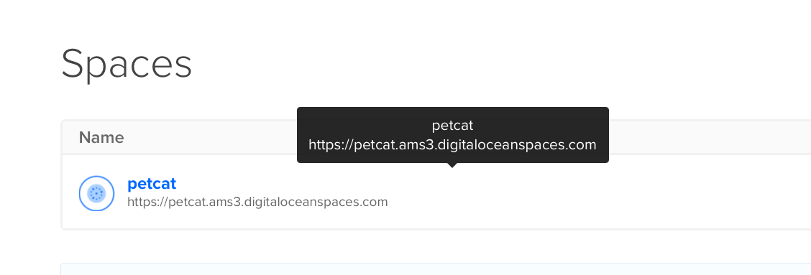
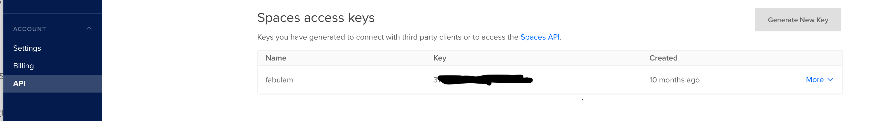

## How to setup 

Make sure you get yourself a Digital Ocean (DO) account, see [my referral link >>](https://m.do.co/c/64146d5a03d9)   

Create yourself a Space, using DO account.  

In this screenshot, as an example, you can see;    
- `BUCKET_NAME: petcat`
- `REGION: ams3`

Now you just need to create API access key.  

`DO_SPACES.key` and `DO_SPACE.secret` can be retrieved from that screen

NB! Remember to save your `key` and `secret` in a safe place and never commit to any public repo!    

Alrite then, now we can put those into Firebase config, this is where from your `functions` uses them as environment vars.   
   
```
# To add them to Firebase config 
firebase functions:config:set \
  do_spaces.key="FIXME_DO_SPACES_KEY" \
  do_spaces.secret="FIXME_DO_SPACES_SECRET" \
  do_spaces.url="REGION.digitaloceanspaces.com" \
  do_spaces.bucket="BUCKET_NAME" \
  do_spaces.cdn="CDN_NAME"

# to verify that config is set, you can check via  
firebase functions:config:get

# to deploy your 'functions'   
$ firebase deploy --only functions  

```

Check Firebase console to verify that your functions are correctly deployed.  
